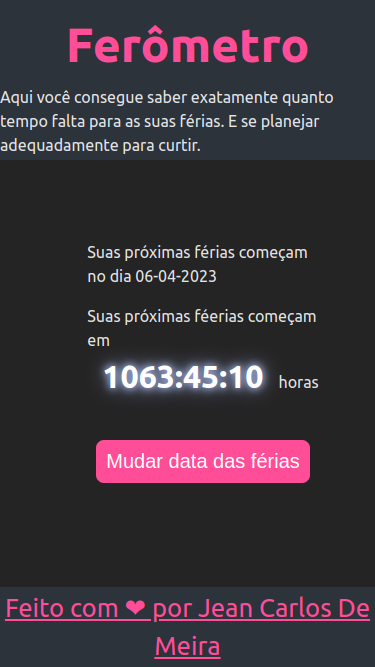
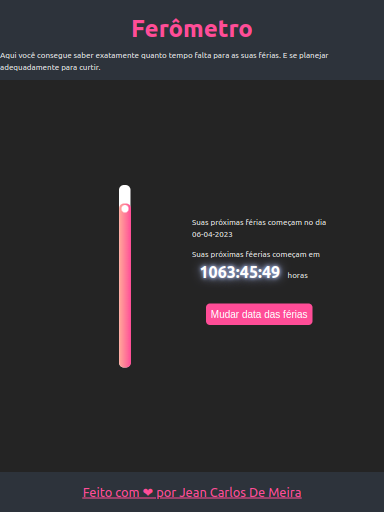
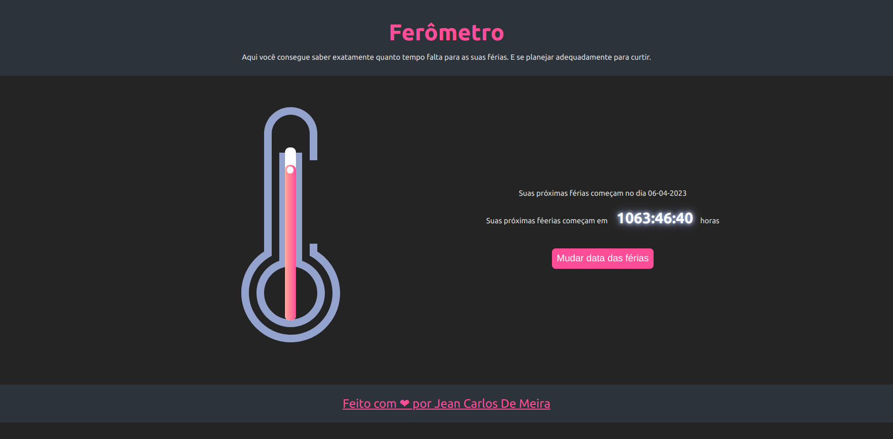
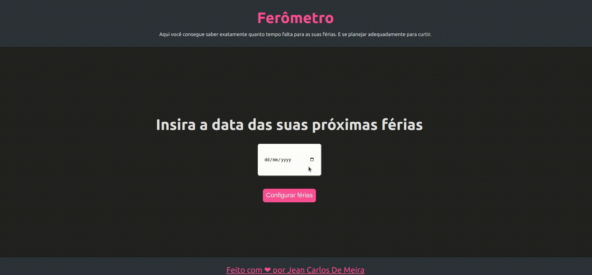

<p align="center">
  <image
  src="https://img.shields.io/github/languages/count/JCDMeira/ferometro"
  />
  <image
  src="https://img.shields.io/github/languages/top/JCDMeira/ferometro"
  />
  <image
  src="https://img.shields.io/github/last-commit/JCDMeira/ferometro"
  />
  <image
  src="https://img.shields.io/github/watchers/JCDMeira/ferometro?style=social"
  />
</p>

# 📋 Indíce

- [Proposta](#id01)
  - [O desafio](#id01.1)
- [Screenshots](#id02)
- [Feito com](#id03)
- [Pré-requisitos](#id04)
- [Procedimentos de instalação](#id05)
- [Autor](#id06)

# 🚀 Proposta <a name="id01"></a>

A ideia desse projeto surgiu de uma conversa com o meu pai, que estava fazendo uma tabela do excel para contar o tempo que faltava para as próximas férias.

Dessa forma construi o que ele chamou de Ferômetro, ou o termômetro de férias, que indica o quanto tempo falta para as próximas férias.

Fazendo alusão a um termômetro também desenhei um medidor em forma de termômetro que mostra em escala a próximidade para as férias.

## :trophy: O desafio <a name="id01.1"></a>

<br />

O desafio foi fazer algo funcional e que tivesse persistência da informação do localStorage. Trabalhando com múltiplas transformações do dado da data das férias e manipulação para fazer a contagem e como salvar e obter os dados de data do localStorage.

<br />

# :camera_flash: Screenshots <a name="id02"></a>

<br />

## :iphone: Mobile design

<p  align="center">
  </img>
</p>

## :iphone: Tablets design

<p  align="center"></img></p>

## :desktop_computer: Desktop design

<p  align="center"></img></p>

## chart_with_upwards_trend result of my work

<p  align="center"></img></p>

<br />

# 🛠 Feito com <a name="id03"></a>

<br />

- [React](https://reactjs.org/)
- [Styled components](https://styled-components.com)
- [CSS Clip-path](https://medium.com/@jean.meira10/usando-clip-path-para-dar-qualquer-formato-a-uma-div-1f4c952b01b6)
- [Vite](https://vitejs.dev)
- [date-fns](https://www.npmjs.com/package/date-fns)

<br />

# ☑️ Pré-requisitos <a name="id04"></a>

<br />

- [x] Editor de código de sua preferência (recomendado VS code)
- [x] Git
- [x] Gerenciador de pacotes Yarn ou NPM

<br />

# 📝 Procedimentos de instalação <a name="id05"></a>

<br />

Clone este repositório usando o comando:

```bash
git clone https://github.com/JCDMeira/ferometro.git
```

Na pasta do projeto instale as dependências com uso do npm ou yarn

```bash
npm install

ou

yarn install
```

<br />

# :sunglasses: Autor <a name="id06"></a>

<br />

- Linkedin - [Jean Carlos De Meira](https://www.linkedin.com/in/jeanmeira/)
- Instagram - [@jean.meira10](https://www.instagram.com/jean.meira10/)
- GitHub - [JCDMeira](https://github.com/JCDMeira)
